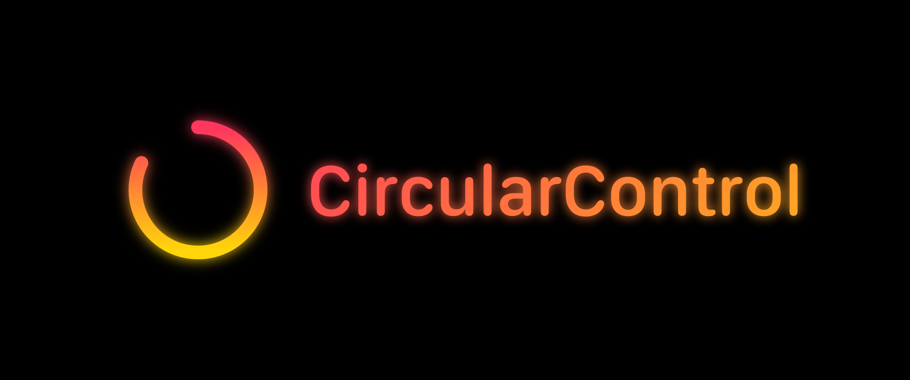
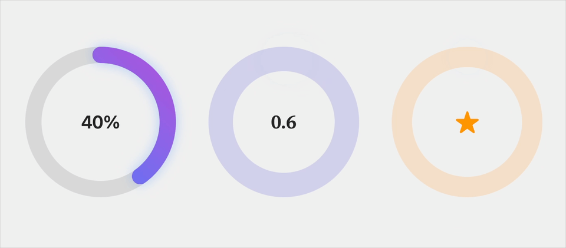
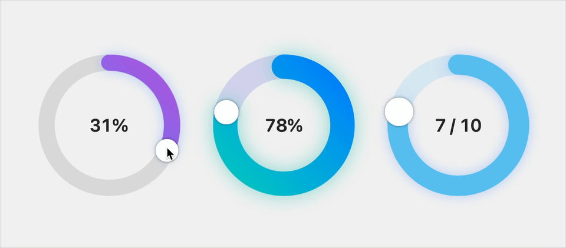
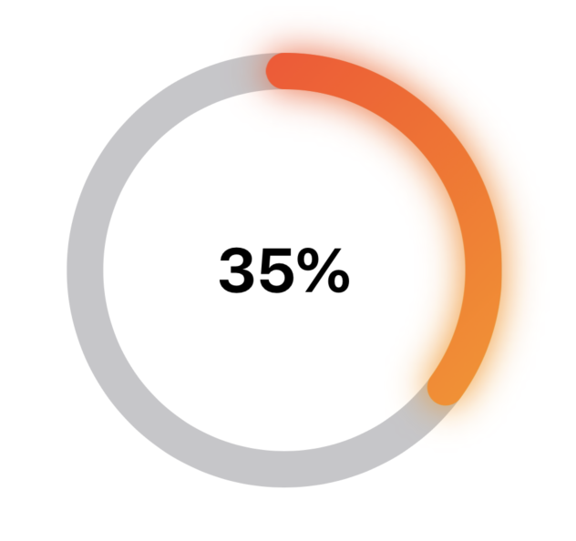
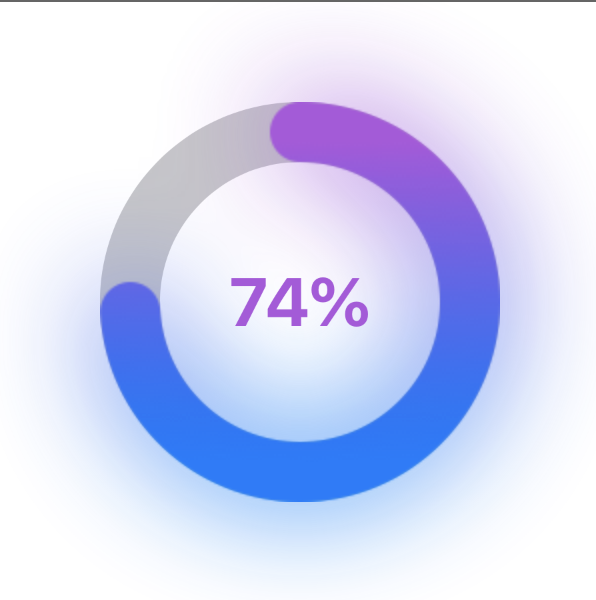

# SwiftUI Circular Control

A cross-platform, highly customizable circular progress control for SwiftUI.

[](https://swift.org/package-manager)
[](https://developer.apple.com/swift)
[](https://swift.org)

## Features

- Use as an editable control or a progress indicator
- Rich customization options with built-in and custom styles
- Built-in animation and transition support

## Installation

### Swift Package Manager

Add PZCircularControl to your project through Xcode's package manager:

1. File > Add Package Dependencies
2. Add https://github.com/philptr/PZCircularControl.git

Or add it to your `Package.swift`:

```swift
dependencies: [
    .package(url: "https://github.com/philptr/PZCircularControl.git", from: "1.0.0")
]
```

## Quick Start

### Static Progress



You can add a simple yet customizable progress indicator to your view in a single line of code.

```swift
// Basic usage:
CircularControl(progress: 0.4)

// Customized style:
CircularControl(
    progress: 0.75,
    strokeWidth: 15,
    style: .init(
        track: Color.secondary.opacity(0.25),
        progress: LinearGradient(
            colors: [.teal, .mint],
            startPoint: .topLeading,
            endPoint: .bottomTrailing
        )
    )
)
```

### Interactive Control



```swift
import CircularControl

struct ContentView: View {
    @State private var progress = 0.7
    
    var body: some View {
        // A basic interactive control usage with the default style:
        CircularControl(progress: $progress)
        
        // A customized interactive control with a custom style:
        CircularControl(
            progress: $progress,
            strokeWidth: 15,
            style: .init(
                track: Color.secondary.opacity(0.2),
                progress: LinearGradient(
                    colors: [.blue, .purple],
                    startPoint: .topLeading,
                    endPoint: .bottomTrailing
                )
            )
        )
    }
}
```

Check out the example project for more usage examples.

## Customization

### Styles

PZCircularControl supports custom styles for the track, the progress bar, and the interactive knob:

```swift
let style = CircularControlStyle(
    track: Color.gray.opacity(0.2),
    progress: LinearGradient(colors: [.blue, .purple]),
    knob: Color.white
)

CircularControl(
    progress: progress,
    style: style
) {
    Text("\(Int(progress * 100))%")
}
```

### Custom Labels

You can provide any SwiftUI view as a label:

```swift
CircularControl(progress: progress) {
    VStack {
        Image(systemName: "star.fill")
        Text("\(Int(progress * 100))%")
    }
}
```

To simplify your custom label implementation, you can read `circularControlProgress` from environment.

### Environment Configuration

Configure behavior through environment values:

```swift
CircularControl(progress: $progress)
    // Enable continuous wrapping (off by default).
    .circularControlAllowsWrapping(true)
    // Adjust the scale of the interactive knob.
    .circularControlKnobScale(2.0)
```

### Progress Updates

You don't have to use the Binding-based initializer to support user interaction. Instead, you may provide an initial value, specify the `isEditable` parameter, and track changes via a closure.

```swift
CircularControl(
    progress: progress,
    isEditable: true
) { newValue in
    print("Progress updated to \(newValue).")
}
```

## Migration

The API surface of PZCircularControl has been completely reworked in 1.0.0 to better match the latest Swift and SwiftUI conventions, support editing, and provide more opportunities for client customization. For details about the legacy API and support for older OS versions, view the section below.

Migration guide:
1. Replace `PZCircularControl` with `CircularControl`.
2. Convert `PZCircularControlParams` to the new style system.
3. Move any overlay views to the new label view builder.
4. Update progress handling to use the new binding-based API.

<details>

<summary>Versions 0.x</summary>

## Usage

1. Install via Swift Package Manager
2. Create a `PZCircularControlParams` object to configure the style of your control (optional)
3. Instanciate a `PZCircularControl` and pass in the params

### Basic example

```swift
PZCircularControl(
    PZCircularControlParams(
        innerBackgroundColor: Color.clear,
        outerBackgroundColor: Color.gray.opacity(0.5),
        tintColor: LinearGradient(gradient: Gradient(colors: [.red, .orange]), startPoint: .topLeading, endPoint: .bottomTrailing)
    )
)
```

This produces the following output:



The params object's instance data can be modified and animated. For example, the following code animates the control to the 35% state when the button is tapped:

```swift
PZExampleButton(label: "35%", font: .headline) { 
    withAnimation(.easeInOut(duration: 1.0)) { 
        control.params.progress = CGFloat(0.35) 
    } 
}
```

## More examples

### Dark background (see cover image)

```swift
PZCircularControl(
    PZCircularControlParams(
        innerBackgroundColor: Color.black,
        outerBackgroundColor: Color.black,
        tintColor: LinearGradient(gradient: Gradient(colors: [.yellow, .pink]), startPoint: .bottomLeading, endPoint: .topLeading),
        textColor: .orange,
        barWidth: 24.0,
        glowDistance: 15.0,
        initialValue: CGFloat(Float.random(in: 0...1))
    )
)
```

### Purple text and gradient fill

```swift
PZCircularControl(
    PZCircularControlParams(
        innerBackgroundColor: Color.clear,
        outerBackgroundColor: Color.gray.opacity(0.5),
        tintColor: LinearGradient(gradient: Gradient(colors: [.blue, .purple]), startPoint: .bottomLeading, endPoint: .topLeading),
        textColor: .purple,
        barWidth: 30.0,
        glowDistance: 30.0,
        initialValue: CGFloat(Float.random(in: 0...1))
    )
)
```



## Customization

`PZCircularControlParams` object is accessible through the `params` instance field of a `PZCircularControl`. Any change to the instance will be reflected on the control automatically, without the need to refresh it or reload any data. 

Some customization options include:
* `progress` (accessible via `<<yourControlInstance>>.params.progress`) – the current progress the control displays (from 0.0 to 1.0, as `CGFloat`).
* `glowDistance` – the radius of the glow effect around the control (`CGFloat`). Set to 0.0 to remove the glow.
* `barWidth` – the width of the stroke of the control.
* `textColor` – the progress label color (as SwiftUI `Color`).
* `font` – the progress label font (as SwiftUI `Font`).
* `innerBackgroundColor` – the color of the inner part of your control (inner radius). Has to conform to `ShapeStyle` (ie. anything from `Color` to `Gradient`).
* `outerBackgroundColor` – the color of the active part's background. Has to conform to `ShapeStyle` (ie. anything from `Color` to `Gradient`).
* `tintColor` – the tint color of the active area of your control. Has to conform to `ShapeStyle` (ie. anything from `Color` to `Gradient`).
* `textFormatter` – an optional closure that takes in a CGFloat value of the current progress between 0.0 and 1.0 and returns formatted text that will be displayed in the center of the progress bar.

</details>

## License

MIT License

Copyright (c) 2019-2024 Phil Zakharchenko

Permission is hereby granted, free of charge, to any person obtaining a copy of this software and associated documentation files (the "Software"), to deal in the Software without restriction, including without limitation the rights to use, copy, modify, merge, publish, distribute, sublicense, and/or sell copies of the Software, and to permit persons to whom the Software is furnished to do so, subject to the following conditions:

The above copyright notice and this permission notice shall be included in all copies or substantial portions of the Software.

THE SOFTWARE IS PROVIDED "AS IS", WITHOUT WARRANTY OF ANY KIND, EXPRESS OR IMPLIED, INCLUDING BUT NOT LIMITED TO THE WARRANTIES OF MERCHANTABILITY, FITNESS FOR A PARTICULAR PURPOSE AND NONINFRINGEMENT. IN NO EVENT SHALL THE AUTHORS OR COPYRIGHT HOLDERS BE LIABLE FOR ANY CLAIM, DAMAGES OR OTHER LIABILITY, WHETHER IN AN ACTION OF CONTRACT, TORT OR OTHERWISE, ARISING FROM, OUT OF OR IN CONNECTION WITH THE SOFTWARE OR THE USE OR OTHER DEALINGS IN THE SOFTWARE.
